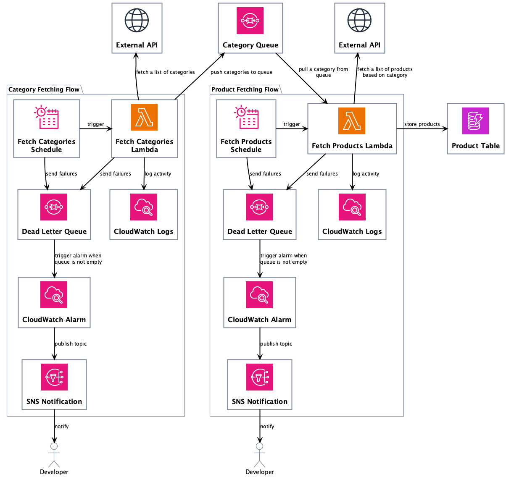

# Woolworths Price Tracker

A web application that tracks the price history of Woolworths products.

## Serverless Architecture

## Technical Decisions

### Infrastructure

There are two choices available:

1. Server-based (e.g. Virtual Private Server - VPS)
2. Serverless (e.g. AWS Lambda and managed services)

#### Option 1: Server-based

The VPS-based approach is attractive because it allows end-to-end testing locally and straightforward deployment via Docker containers. However, VPS servers, particularly those from affordable cloud providers, often inherit IP addresses with poor reputations due to historical abuse. This leads to higher chances of being blocked by third-party websites.

I conducted proof-of-concept tests using DigitalOcean and AWS LightSail, where both instances were unable to fetch the target homepage using a `curl` command. This suggests IP-based blocking is already in place against these providers, reducing the viability of this approach.

#### Option 2: Serverless

While serverless solutions are less convenient to test locally, they offer a key advantage:
a dynamic pool of outbound IP addresses. This makes it harder for third-party websites to apply broad IP-based blocks, increasing reliability for external data access.

AWS was chosen over alternatives like Azure or Google Cloud primarily to expand my hands-on experience with AWS. I already have significant exposure to Azure, and this project offered a valuable opportunity to deepen my familiarity with AWS services and deployment patterns.

### Data-fetching Strategy

There are two choices available:

1. Browser-based scraping (e.g. Playwright, Selenium)
2. Direct API data fetching

#### Option 1: Browser-based scraping

This method simulates real-user behavior, making it harder for the target website to detect automated access. Additionally, the fetched data mirrors exactly what a human user would see, ensuring high accuracy.

However, this approach comes with trade-offs:
- Fragility: Small changes to the website’s layout can break the extraction logic.
- Resource-intensive: Running browser-based automation requires significantly more compute power, especially at scale.
- Parsing overhead: Extracted data often requires additional parsing and cleaning before it can be processed.

#### Option 2: API data fetching

This approach requires identifying and accessing the website’s API endpoints. In this case, the target website supports a suitable API endpoint.

This approach provides:
- Well-structured and consistent data.
- Lower compute resource requirements for the fetching process.
- Minimal impact on the target website’s infrastructure, since API calls are usually lighter than full browser-based page loads.

This reduced footprint also decreases the likelihood of triggering rate-limiting or being flagged for blocking, as the requests align more closely with intended usage patterns.
